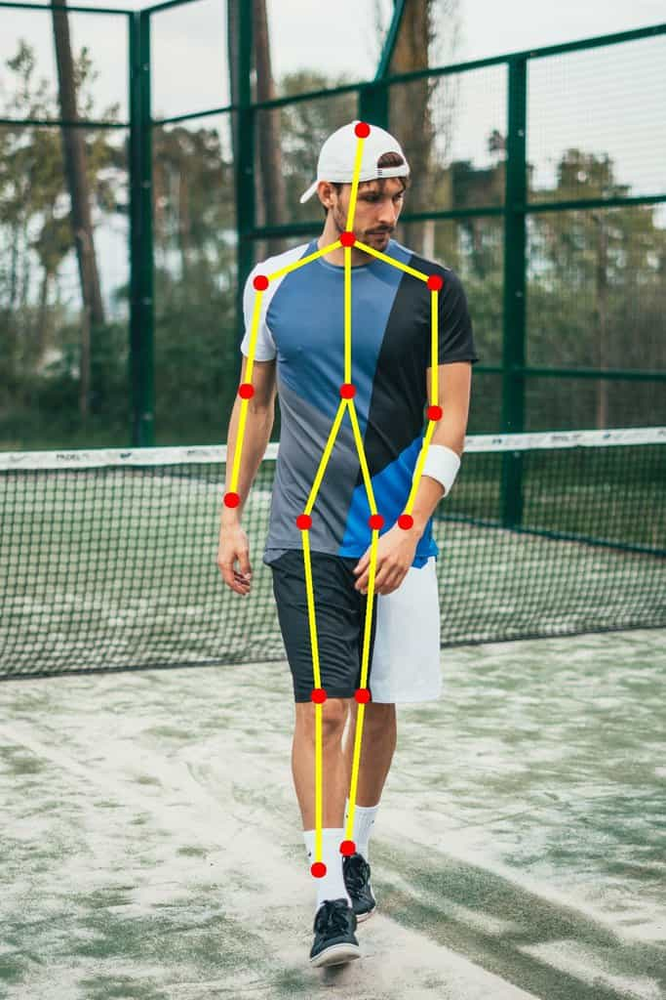

# Human_pose_detection_group54

This repository contains the implementation of OpenPifPaf, an open-source framework for pose estimation, using the COCO dataset. OpenPifPaf provides a powerful and flexible solution for detecting keypoints and generating human pose estimations.

## Introduction
For our Deep Learning for Autonomous Vehicles class, we had to solve a task which was part of an autonomous driving vehicle. We chose the task about the 2D human pose detection for which we had to predict the pose of a human body in a given 2D image. This includes the positions and orientations of various body parts, such as the head, shoulders, elbows, wrists, hips, knees, and ankles. In order to do that, we will start from a state-of-the-art deep learning model, OpenPifPaf, desgined to detect and estimate the poses of multiple people in 2D images. We will use the MS COCO dataset, usually used for various computer vision tasks

Cloning the state of the art code:
!git clone https://github.com/vita-epfl/openpifpaf

Data Download:
We directly downloaded zip files from the coco data set wesite. 
Download and set up the COCO dataset:

Download the COCO 2017 dataset from http://cocodataset.org/#download.
Extract the dataset to a desired location on your machine.
Update the paths to the COCO dataset in the configuration files or command-line arguments when running OpenPifPaf.

-Validation set (val2017)
-Train set (train2017)
-Test Set (test2017)
-annotation file 
  -person_keypoints_val2017
  -person_keypoints_train2017
 

  
Download all the requirements :

pip install -r requirements.txt

In setup.py you can find a list of the required packages at the bottom

## Training

To train a pose estimation model using OpenPifPaf with the COCO dataset, follow these steps:

Set up the COCO dataset as mentioned in the installation steps.

Configure the training settings:

Modify the configuration file openpifpaf/config/coco.json to adjust the training parameters, such as the backbone network, learning rate, batch size, etc.
Ensure that the paths to the COCO dataset are correctly specified in the configuration file.
Start the training:

In our case we wanted to add a hrformer backbone:
 
You can use this githib to find the openpifpaf with the implementation of the hrformer:

https://github.com/michaelkoepf/vita-epfl-openpifpaf/tree/hrformer_backbone

Regrettably, there is no simple method available to automatically download the pre-trained ImageNet1K weights without adding extra dependencies. This is due to the fact that the authors have stored the weights on OneDrive. Therefore, you will need to manually download the weights by following the instructions provided at https://github.com/HRNet/HRFormer/blob/main/cls/README.md.

Once you downloaded  the checkpoint from the internet and add it to a new file in /content

Regrettably, there is no simple method available to automatically download the pre-trained ImageNet1K weights without adding extra dependencies. This is due to the fact that the authors have stored the weights on OneDrive. Therefore, you will need to manually download the weights by following the instructions provided at https://github.com/HRNet/HRFormer/blob/main/cls/README.md.

In our case we used the tiny: hrt_tiny.pth for the HRFormer
Make sure the downloaded weights match the selected HRFormer backbone (HRFormer Tiny, Small, or Base).

To utilize the pre-trained weights, specify the path to the weights using the --hrformer-checkpoint=<path to weights> option. It is crucial to ensure that the pre-trained weights correspond to the specified base network.

If you wish to exclude the final layer of the HRFormer, include the --hrformer-remove-final-layer option. This will result in output feature maps of size 1024 instead of 2048. ( We realized training was faster )- Not necessary
  
Train by calling the cocokp data set:
  dataset=cocokp
  
You can read the  https://openpifpaf.github.io/intro.html to know what arguments can be implememnted for the training for the cocokp data set 
  
Monitor the training progress:

The training progress and log information will be displayed in the console.
Checkpoints of the trained models will be saved in the directory specified in the configuration file.
  
This is an exemple of the hyperparameters you can use:
  
!python3 -m openpifpaf.train --ddp \
  --dataset=cocokp \
  --cocokp-square-edge=193 \
  --cocokp-extended-scale \
  --cocokp-orientation-invariant=0.1 \
  --cocokp-upsample=2 \
  --cocokp-train-annotations=/content/data-mscoco/annotations/person_keypoints_train2017.json \
  --cocokp-val-annotations=/content/data-mscoco/annotations/person_keypoints_val2017.json \
  --cocokp-train-image-dir=/content/data-mscoco/images/train2017/ \
  --cocokp-val-image-dir=/content/data-mscoco/images/val2017/ \
  --basenet=resnet50 \
  --epochs=1 \
  --batch-size=4 \
  --momentum=0.95 \
  --lr=0.001 \
  --output /content/test/checkpoints/job.pt \
  --log-interval=2 \
  --basenet=hrformer_t \
  --hrformer-checkpoint=content/hrt_tiny.pth

## Test 
  
To perform pose estimation on test images using the trained model, follow these steps:

Prepare the test images:

Place the test images in a directory of your choice.
Perform pose estimation:
  
python -m openpifpaf.predict \
    --checkpoint /path/to/checkpoint.pt \
    --image-dir /path/to/test/images/ \
    --output-dir /path/to/output/predictions/
  
  
Replace /path/to/checkpoint.pt with the path to the trained model checkpoint file.
Replace /path/to/test/images/ with the directory containing the test images.
Specify the output directory where the pose estimation predictions will be saved.

## Analyze the results:

The predictions will be saved in the specified output directory.
You can visualize or analyze the results using the provided OpenPifPaf tools or custom scripts.

## Conclusion
OpenPifPaf with HRFormer backbone extends the capabilities of pose estimation on the COCO dataset. By following the installation, training, and inference steps outlined in this readme, you can leverage OpenPifPaf with HR
  

  

